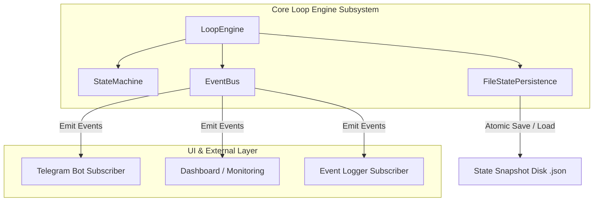
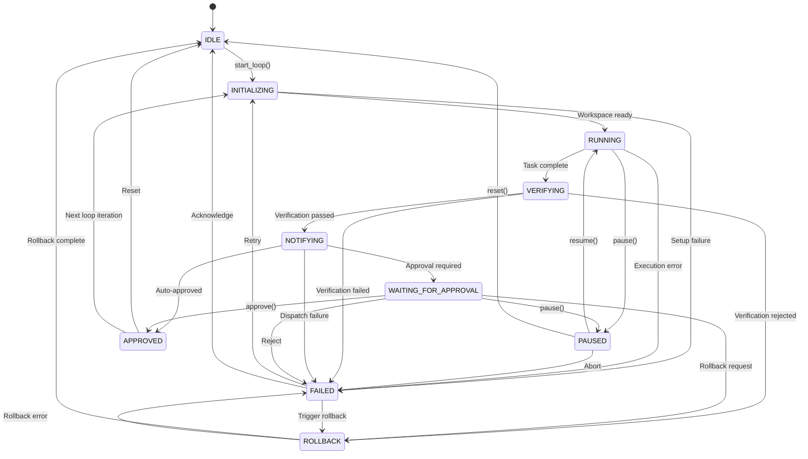

# Core Loop Engine & State Machine (Loop #002)

## Overview

The **Core Loop Engine** is the core operational engine of Chawkidaar. It manages autonomous AI agent execution loops across software projects using an explicit Finite State Machine (FSM), a decoupled Event Bus, structured logging, and crash-resilient state persistence.

The Loop Engine is completely decoupled from any UI layer, Telegram bot, or specific coding agent framework. All UI notification adapters, dashboard monitors, and logging sinks subscribe to events emitted on the internal `EventBus`.

---

## Architecture Diagram

---

## Finite State Machine

The Loop Engine enforces a strictly validated 10-state progression model.

### States

1. `IDLE`: Initial idle state before a loop starts.
2. `INITIALIZING`: Setting up project context, loading persistence state, and preparing execution workspace.
3. `RUNNING`: Executing autonomous agent task steps.
4. `VERIFYING`: Running test suites, code linters, or validation criteria.
5. `NOTIFYING`: Event notification dispatch requesting approval or reporting status.
6. `WAITING_FOR_APPROVAL`: Pending human or supervisor decision.
7. `APPROVED`: Loop execution successfully validated and approved.
8. `PAUSED`: Execution temporarily halted by user command.
9. `FAILED`: Task step execution or verification failure.
10. `ROLLBACK`: Reverting workspace to last recorded checkpoint.

### State Transition Diagram

---

## Event Architecture

The `EventBus` provides publish-subscribe decoupling. Subscribers register callbacks for specific event types or globally across all events (`subscribe(event_type, callback)`).

### Core Events

- `LoopStarted`: Emitted when a new loop cycle is initialized.
- `VerificationStarted`: Emitted when verification checks begin.
- `VerificationPassed`: Emitted when verification succeeds.
- `VerificationFailed`: Emitted when verification fails.
- `NotificationRequested`: Emitted when status notification is requested.
- `WaitingForApproval`: Emitted when loop enters human approval stage.
- `LoopApproved`: Emitted when loop execution is approved.
- `LoopFailed`: Emitted when a loop fails.
- `LoopPaused`: Emitted when loop is paused.
- `StateChanged`: Emitted on every state transition (`from_state`, `to_state`).

---

## Persistence & Crash Recovery

State snapshot (`LoopStateSnapshot`) persistence guarantees crash resilience:

- **Atomic Writes**: Uses temporary file writes (`.tmp`) and `os.replace` to prevent corrupted `.json` state files even during unexpected process kills.
- **Auto Recovery**: On application start, `LoopEngine` automatically loads the latest valid state snapshot from disk (`.chawkidaar/state.json`) and restores `current_loop_number`, `active_project`, `started_time`, `last_checkpoint`, and `current_state`.

---

## Key Design Decisions

1. **Strict State Boundaries**: Unallowed state transitions raise an `InvalidStateTransitionError` exception immediately to prevent engine corruption.
2. **Subscriber Exception Isolation**: Subscriber callback errors caught by `EventBus` are logged silently, ensuring subscriber bugs never crash the main execution engine.
3. **Decoupled Architecture**: Zero imports of Telegram libraries or external UI frameworks within the `chawkidaar.loops` module.
